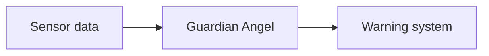
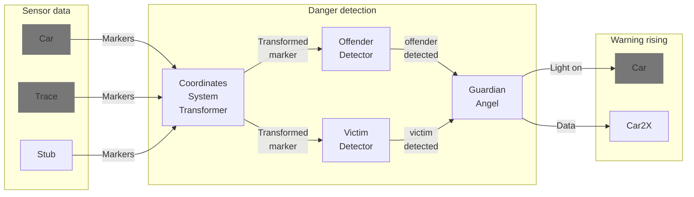

# Hack the Car by Coffee Driver (IAV)

## Idea for Our Tool: Warning Traffic Participants of Danger Situations using Car2X Communication

The idea for our tool comes from recognizing the need to improve communication between vehicles on the road. Specifically, we aim to address the issue of potential danger situations arising when interacting with other road users.To achieve this, we have developed a tool that uses Car2X communication to warn traffic participants if a danger situation can arise.  
By providing clear and timely communication to other road users, we believe we can increase safety and reduce the number of accidents on the road. We recognize the importance of efficient and effective communication and strive to contribute to the development of a safer transportation system.
We have chosen to focus on one specific scenario for the SDV Hackathon 2023 challenge due to the limited timeframe.


## Covered scenario

The scenario we have chosen to focus on for the SDV Hackathon 2023 challenge involves a pedestrian about to cross the street in front of or behind the Ego vehicle while another vehicle (Offender) is passing through. In this situation, there is a risk of an accident occurring if both the Offender and the pedestrian are not aware of each other's presence.
To prevent this from happening and increase road safety, our tool is designed to activate the indicator lights in the Ego vehicle as a warning signal. This warning signal will alert both the Offender and the pedestrian of the potential danger and allow them to take appropriate actions to avoid an accident.
Our tool uses Car2X communication to detect the presence of the Offender and the pedestrian and determine their positions relative to the Ego vehicle. If both are present at the same time, the tool triggers the indicator lights in the Ego vehicle. This feature is designed to provide a clear and timely warning to all parties involved and reduce the risk of accidents.


```
=======================================


---   ---   ---   ---   ---   ---   ---
  ----------
  |Offender|-------->   !
  ----------
                        ^
    -------   --------- | -------
    |     |   |Ego car| | |     |
    -------   --------- | -------
========================|==============
                        O
```

## Approach : Detection Algorithm and Warning System


Our tool uses the Ego car sensor array to detect two defined traffic participants: the Offender and the Victim. The detection process includes selecting relevant objects and determining their intentions.

The development of the detection algorithm is separated into two complexity stages:

 - Stage 1: we use a simple static check to determine if either the vehicle or pedestrian is in the defined danger zone. 
 - Stage 2: we build movement vectors to recognize situations dynamically.

If a potential danger situation is identified, our tool activates a warning system. The available Ego vehicle can activate turn signal lights as a warning to all parties involved.
In addition to this warning system, other warning channels and visualizations are possible. 

- Using car lights to visually alert traffic participants to the warning, specifically highlighting the pedestrian to improve visibility. 
- Car-to-car communication  to warn the Offender via their HMI to prepare for, or execute, braking.
- Our tool could utilize the built-in music system to audibly communicate the danger and its direction to the pedestrian. 
- Anonymized post into the (city traffic) Cloud to train the AI and detect potential danger spots.

## Realization

Our primary focus in the realization of this tool is to implement the logic for detecting relevant objects and triggering a warning system in case of potential danger situations.



Both the sensor data and the warning system are provided by the given car over a high-level abstraction layer.

### Data flow



### Sensor data feeding

In our development process, we utilize both a recorded trace from a set of sub-scenarios and an implemented stub to populate objects in the Ego vehicle environment.
The scenario we are covering involves the detection of two traffic participants: the Offender and the Victim. To better understand the world representation with the provided sensor data, we recorded two isolated traces in addition to a complete trace:

- The movement of the passing car (Offender)
- The movement of the pedestrian (Victim), including movement around the Ego car to determine its dimensions
- Simultaneous movement of both the Offender and the Victim.

These traces provide us with a more comprehensive understanding of the movements and behavior of the traffic participants involved in the scenario. 
Using this data, we can create an effective detection algorithm that accurately identifies potential danger situations and triggers the appropriate warning system.


### Coordinate system transformation

The trace data provided contains coordinates in a world-related coordinate system. Although the axes of this system may not necessarily be parallel to those of the car-related coordinate system.
To detect the parallelism of the Offender trajectory, we require a coordinate system transformation. The offset and angles of rotation for all three coordinates are provided by the car abstraction layer. 

This transformation allows us to accurately determine the position and movement of the Offender relative to the Ego vehicle.Through careful analysis and implementation of these transformations, we can create an effective detection algorithm that accurately identifies potential danger situations and triggers the appropriate warning system.
### Integration of the Guardian Angel components

Transfer of the data from and to the components is realized with
eCAL messages containing objects in protobuf-format.
All components subscribe to certain message topics,
which gives the possibility to visualize the inter-component communication
and to inject synthetic messages for testing purposes.
A stub is developed to provide the message generation with wished values.

### Testing

The behavior of every component and the whole system should be tested
to ensure the correct

The system is developed in a modular architecture with defined data containers (messages).
So can every component be tested isolated, but as a part of a (sub-)system.

````mermaid
    flowchart LR
  Stub -- Stimulation --> Component -- Result --> Evaluation

````

````mermaid
    flowchart LR
  Stub -- Stimulation --> Component1 --> Component2 -- Result --> Evaluation

````

### Rising of the warning

### Visualization

