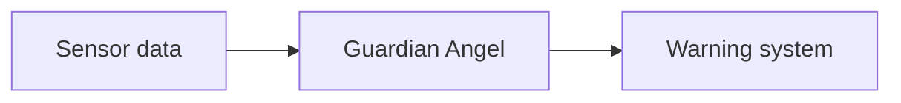
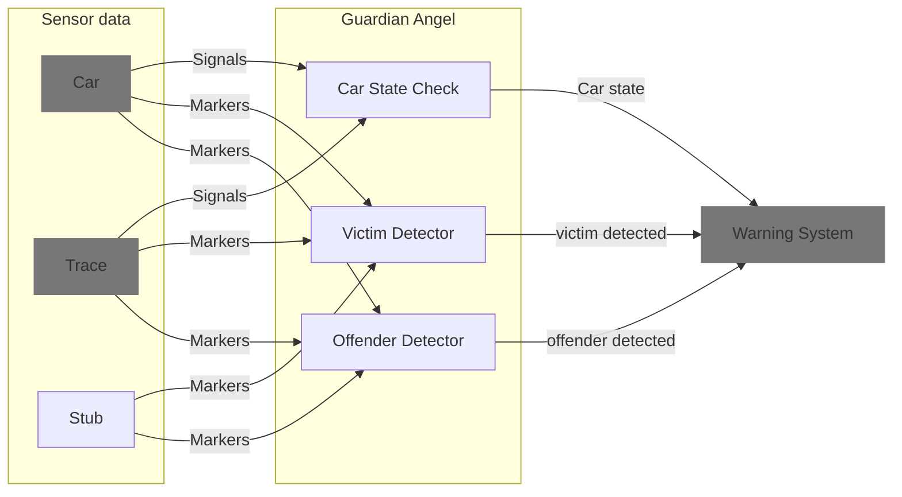

# Hack the Car by Coffee Driver (IAV)

## Idea

We want to warn the traffic participants, if a danger situation can arise. 
For purposes of SDV Hackathon 2023 challenge we cover only one scenario.

## Covered scenario

Assumed the target car (Ego car) is parked on the street shoulder, we want to detect, 
if, at the same time, a pedestrian is about to walk across the street for or behind the Ego car
and a car (Offender) passes the Ego car.
In this case can the pedestrian be harmed by the passed car.
To prevent it both traffic participants should be warned by the Ego car,
which make the Ego car incarnate a Guardian Angel (in the meaning of protecting the pedestrian).

```
=======================================


---   ---   ---   ---   ---   ---   ---
  ----------
  |Offender|-------->   !
  ----------
                        ^
    -------   --------- | -------
    |     |   |Ego car| | |     |
    -------   --------- | -------
========================|==============
                        O
```

## Approach

We use the Ego car sensor array to detect the both defined traffic participants:
the Offender and the Victim.
The detection includes the selecting the relevant objects and their intention.
The development of this detection algorythm is separated into two complexity stages:

- Stage 1 with simple static check, if any of both object types (car, pedestrian) is in the defined danger zone
- Stage 2 with movement vector building to recognise the situation in dynamic sense

If a potential danger situation is recognized, a warning should be fired.
The available Ego car is capable to activate the turn signal lights.
For the hackathon challenge we make use of only this feature.
Further warning channels and visualization are imaginable:

- Car lights to side select warning
- Car lights to spot the pedestrian to improve the visibility
- Car2car communication to the Offender to warn over its HMI and possibly prepare or execute a braking
- The build-in music system to tell the pedestrian about the danger and its direction
- Anonymized post into the (city traffic) cloud to train the AI and detect potential danger spots

## Realization

The focus of the realization is to implement the logic of detection of the relevant objects and to fire a warning.



Both the sensor data and the warning system are provided by the given car over a high-level abstraction layer.

### Data flow


